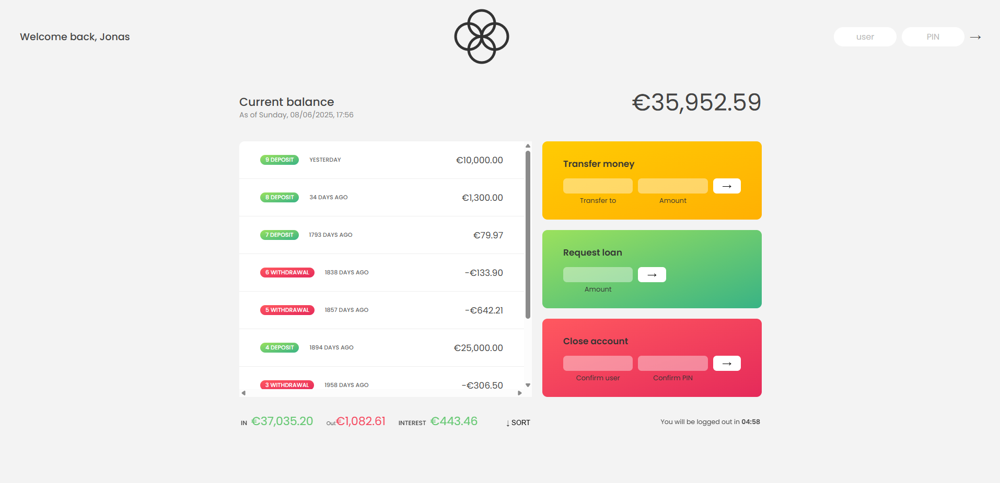
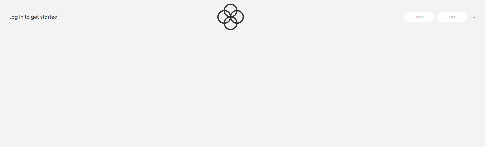

# 💰 Bankist Project

This project focuses on the **fundamentals of JavaScript**, especially working with **Arrays** and **Objects** using modern methods.

## 🚀 Features

- ⚡ Smooth and interactive UI
- ♻️ Reusable functions for clean code
- 📚 Practice with Array methods (`map`, `filter`, `reduce`, `sort`, etc.)
- 🧠 Learn how to structure logic with real-world banking operations

## 📸 Screenshots

### 🏠 Home Page



### 🔐 Login Page



## 🧪 Try It Yourself

[View](https://bankist-mouad.netlify.app/)

> 💡 **Hint:** Use the credentials below to log in and explore the app.

```text
Account 1: Username: js , PIN: 1111
Account 2: Username: jd , PIN: 2222
Account 3: Username: mb , PIN: 3333
```
